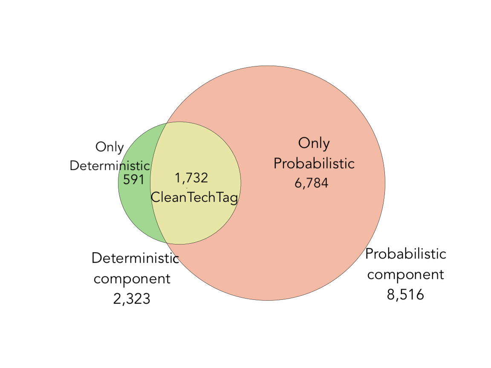

[

---

## Towards aligning EU innovation policy with climate goals: A qualitative-computational assessment of Horizon 2020 funding.

---

It's developed and applied a multi-method qualitative and computational approach to provide an assessment in the domain of climate change mitigation technologies observing public funding for multiple technologies, prioritised by the EU as mitigation technologies. The following documentation describes the development of the CleanTechTag framework.

The description and details of the computational framework and data analysis together with the data and file usage is described here: **[Data Analysis Description](https://github.com/MaastrichtU-IDS/clean-technologies-nlp/tree/master/notebooks/README.md)**

---

### Projects detected by CleanTechTag framework 
  

---

### Total cumulative number of projects and total contribution in million euro made by the EU per sector and technology group during the H2020 framework programme. 
  

---

### Prioritised (below) and non-prioritised (above) technologies costing 50 mln and less, per sector
  

---

### Funding dynamics of the most important clean technologies over time.
  

---

Copyright (C) 2021, Zahar Koretsky, Pedro V. Hernández Serrano, Seun Adekunle.  
This program is free software: you can redistribute it and/or modify it under the terms of the [GNU General Public License](https://www.gnu.org/licenses/gpl-3.0.html) as published by the Free Software Foundation, either version 3 of the License, or any later version.
