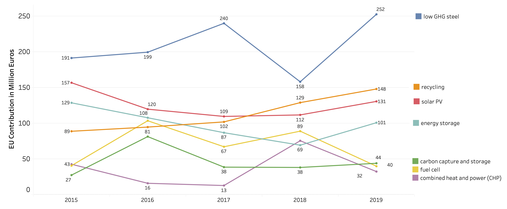

---

### Toward aligning the EU innovation policy with the demand for clean technologies in 1.5 degree worlds: a qualitative and computational study on H2020 projects.

---

Funding dynamics of the most important clean technologies over time.
  
Total cumulative number of projects and total contribution in million euro made by the EU per sector and technology group during the H2020 framework programme. 
  
Prioritised (below) and non-prioritised (above) technologies costing 50 mln and less, per sector
  
Current de facto prioritisation of technologies per category in Horizon 2020 over time (2019 data until the third quarter)
  
